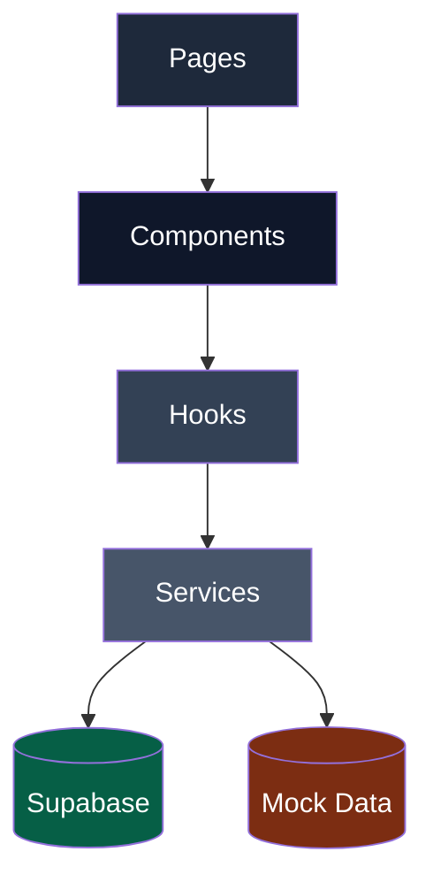
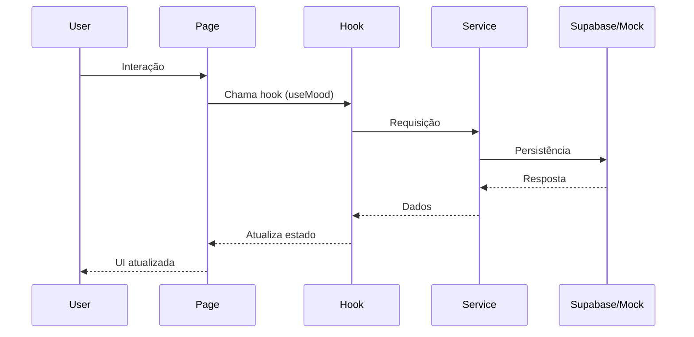
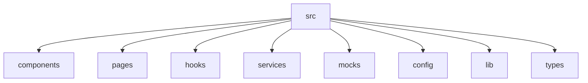
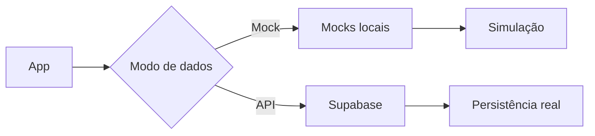

# Fluidity


Aplicação web para **registro e acompanhamento do humor diário**, com foco em bem-estar emocional.

---

# 🧠 Visão do Produto

O **Fluidity** permite que usuários:

* Registrem seu humor diariamente
* Acompanhem padrões emocionais ao longo do tempo
* Visualizem histórico de registros
* Acessem práticas simples de bem-estar

O projeto está em fase de **MVP (Minimum Viable Product)**, com foco na validação da experiência de check-in emocional.

---

# 📱 Interface do projeto


---

# 🏗 Arquitetura (Visão Geral)



---

# 🔄 Fluxo de Dados



---

# 🧩 Arquitetura de Pastas



### Estrutura

| Pasta      | Responsabilidade   |
| ---------- | ------------------ |
| components | UI reutilizável    |
| pages      | Páginas            |
| hooks      | Lógica e estado    |
| services   | Integração com API |
| mocks      | Dados simulados    |
| config     | Configuração       |
| lib        | Utilitários        |
| types      | Tipagens           |

---

# 🔄 Estratégia de Dados



---

# ⚙️ Stack Tecnológica

| Camada       | Tecnologia       | Versão  |
| ------------ | ---------------- | ------- |
| Frontend     | React            | 19.2.x  |
| DOM Renderer | React DOM        | 19.2.x  |
| Linguagem    | TypeScript       | 5.9.x   |
| Roteamento   | React Router DOM | 7.13.x  |
| Build Tool   | Vite             | 7.3.x   |
| Estilização  | Tailwind CSS     | 3.4.x   |
| Backend      | Supabase JS      | 2.98.x  |
| Ícones       | Lucide React     | 0.577.x |

---

# 🧩 Ambiente de desenvolvimento

* Node.js: **22.13.0**
* NPM: **10+**

> Consulte o `package.json` para versões exatas.

---

# 🚀 Funcionalidades

## ✔ Implementadas

* Check-in diário de humor
* Histórico de registros
* Regra de 1 registro por dia
* Persistência com Supabase
* Atualização reativa da UI
* Hooks customizados
* Modo QA com mock

## 🔜 Planejadas

* Autenticação de usuários
* Notificações (reminders)
* Dashboard analítico
* Evolução para PWA
* Biblioteca de práticas

---

# ▶️ Como executar o projeto

```bash
git clone https://github.com/pipocaagil-hash/projeto-fluidity.git
cd projeto-fluidity
npm install
npm run dev
```

Acesse:

```
http://localhost:5173
```

---

# 🔐 Variáveis de ambiente

Crie um `.env`:

```env
VITE_SUPABASE_URL=
VITE_SUPABASE_ANON_KEY=
VITE_USE_MOCK=false
```

---

# 🧪 Modo QA (Mock)

Ativar:

```env
VITE_USE_MOCK=true
```

### Comportamento

* Dados simulados
* Sem chamadas ao backend
* Fluxo completo funcional
* Regra de 1 registro por dia mantida

### Uso ideal

* QA
* Demonstrações
* Desenvolvimento offline

---

# 🧭 Roadmap

* Integração completa com UX
* Sistema de autenticação
* Notificações inteligentes
* Insights emocionais
* Evolução para PWA

---

# 👨‍💻 Autores

**Jair Sousa**
https://github.com/jair-sousa

**Carlos Eduardo**
https://github.com/Carlosedukj
