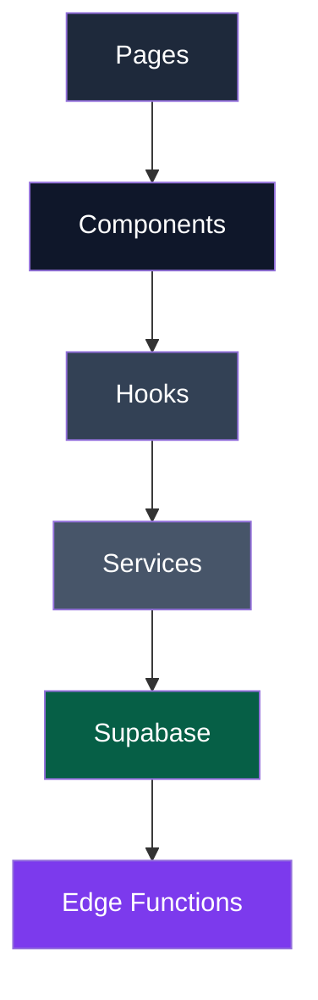
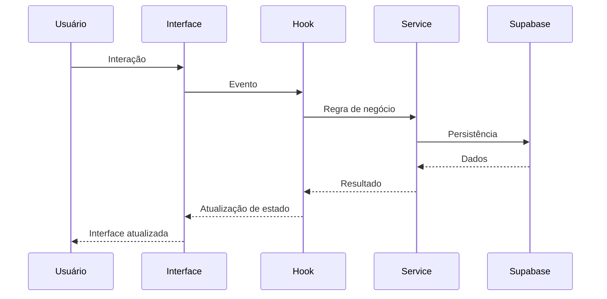
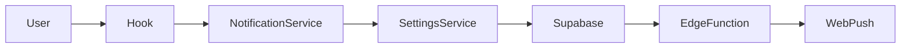
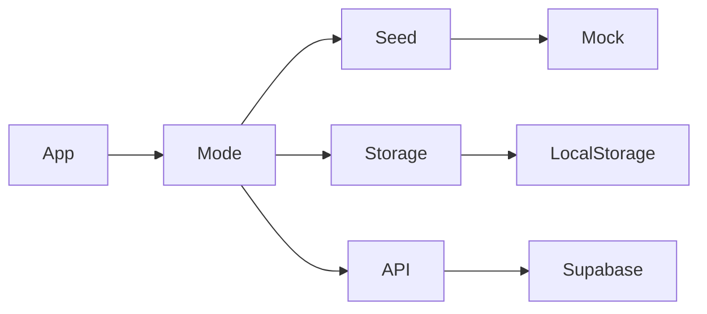

# 🌊 Fluidity


Aplicação web focada no **registro e acompanhamento do humor diário**, oferecendo uma experiência simples para monitoramento do bem-estar emocional através de check-ins, histórico, lembretes inteligentes e recursos voltados à saúde emocional.

---

# 📖 Visão Geral

O **Fluidity** nasceu com o objetivo de incentivar o hábito do registro emocional diário, permitindo que o usuário acompanhe sua evolução ao longo do tempo e receba lembretes inteligentes para manter a consistência dos registros.

O projeto foi desenvolvido seguindo princípios modernos de arquitetura de software, priorizando:

- Clean Code
- Baixo acoplamento
- Separação de responsabilidades
- Componentização
- Escalabilidade
- Facilidade de manutenção

---

# ✨ Funcionalidades

## ✅ Implementadas

### Autenticação

- Cadastro de usuários
- Login
- Logout
- Recuperação de senha
- Atualização de senha
- Contexto global de autenticação

---

### Registro de Humor

- Check-in diário
- Regra de um registro por dia
- Confirmação antes do envio
- Histórico completo
- Visualização dos registros

---

### Exercícios

- Recomendações de práticas de bem-estar
- Exercícios rápidos
- Navegação integrada ao fluxo principal

---

### Lembretes Inteligentes

- Central de lembretes
- Configuração de lembretes
- Gerenciamento de notificações
- Configuração de horários
- Controle de habilitação/desabilitação

---

### Notificações Push

- Infraestrutura preparada para Web Push
- Service Worker
- Push Subscription
- Supabase Edge Functions
- Persistência de configurações

---

### Progressive Web App (PWA)

- Instalável
- Funcionamento semelhante a aplicativo
- Service Worker
- Preparado para notificações

---

# 🏗 Arquitetura

O projeto segue uma arquitetura em camadas buscando reduzir acoplamento entre interface, regras de negócio e infraestrutura.


```mermaid
flowchart TD

Page["Pages"]
Component["Components"]
Hook["Hooks"]
Service["Services"]
Supabase["Supabase"]
Edge["Edge Functions"]

Page --> Component
Component --> Hook
Hook --> Service
Service --> Supabase
Supabase --> Edge

style Page fill:#1e293b,color:#fff
style Component fill:#0f172a,color:#fff
style Hook fill:#334155,color:#fff
style Service fill:#475569,color:#fff
style Supabase fill:#065f46,color:#fff
style Edge fill:#7c3aed,color:#fff
```

---

# 🔄 Fluxo de Dados


```mermaid
sequenceDiagram

participant U as Usuário
participant UI as Interface
participant H as Hook
participant S as Service
participant DB as Supabase

U->>UI: Interação
UI->>H: Evento
H->>S: Regra de negócio
S->>DB: Persistência

DB-->>S: Dados
S-->>H: Resultado
H-->>UI: Atualização de estado
UI-->>U: Interface atualizada
```

---

# 🔔 Fluxo das Notificações


```mermaid
flowchart LR

User --> Hook
Hook --> NotificationService
NotificationService --> SettingsService
SettingsService --> Supabase

Supabase --> EdgeFunction

EdgeFunction --> WebPush
```

---

# 📁 Organização do Projeto

```text
src
├── components
├── config
├── hooks
├── lib
├── mocks
├── pages
├── services
├── types
├── utils

supabase
└── functions
    └── send-push
```

| Diretório | Responsabilidade |
|------------|------------------|
| components | Componentes reutilizáveis |
| pages | Páginas da aplicação |
| hooks | Estado e lógica de UI |
| services | Regras de negócio e integração |
| config | Configurações globais |
| lib | Utilitários compartilhados |
| mocks | Dados simulados |
| types | Tipagens |
| utils | Funções auxiliares |
| supabase/functions | Edge Functions |

---

# ⚙️ Stack Tecnológica

| Camada | Tecnologia |
|---------|------------|
| Frontend | React 19 |
| Linguagem | TypeScript |
| Build | Vite |
| Estilização | TailwindCSS |
| Backend | Supabase |
| Banco | PostgreSQL |
| Autenticação | Supabase Auth |
| Push | Web Push API |
| Edge Functions | Supabase Edge Functions |
| PWA | Service Worker |
| Roteamento | React Router |

---

# 🔀 Estratégia de Dados

O projeto suporta múltiplos modos de execução.


```mermaid
flowchart LR

App --> Mode

Mode --> Seed
Mode --> Storage
Mode --> API

Seed --> Mock
Storage --> LocalStorage
API --> Supabase
```

| Modo | Finalidade |
|-------|------------|
| Seed | Dados fixos para desenvolvimento |
| Storage | Persistência local |
| API | Persistência real no Supabase |

---

# 🚀 Executando Localmente

```bash
git clone https://github.com/Projeto-Fluidity/fluidity

cd projeto-fluidity

npm install

npm run dev
```

Aplicação disponível em:

```
http://localhost:5173
```

---

# 🔐 Variáveis de Ambiente

```env
VITE_SUPABASE_URL=
VITE_SUPABASE_ANON_KEY=

VITE_DATA_MODE=api

VITE_FORCE_ERROR=false
```

---

# 🧪 Qualidade

Durante o desenvolvimento são seguidas as seguintes práticas:

- Auditoria antes de qualquer implementação
- Desenvolvimento incremental
- Pequenos commits
- Baixo acoplamento
- Clean Code
- SOLID
- Componentização
- Hooks especializados
- Services desacoplados
- Validação contínua através de:

```bash
npm run lint
```

```bash
npm run build
```

---

# 🛣 Roadmap

## Em andamento

- Evolução das notificações inteligentes
- Agendamento automático de lembretes
- Insights emocionais

## Futuro

- Dashboard analítico
- Gamificação
- Compartilhamento de progresso
- Integração com dispositivos móveis
- Inteligência Artificial para recomendações personalizadas

---

# 👥 Autores

*DEV*

*Full Stack*
### Jair Sousa 
https://github.com/jair-sousa
https://www.linkedin.com/in/jair-sousa-ads

*Front end*
### Carlos Eduardo

https://github.com/Carlosedukj
https://www.linkedin.com/in/carlosedusobrinho/

*UX*
### Luiz Felipe

*QA*
### João Felismino
https://www.linkedin.com/in/joaofelismino/

*SM*
### Thaise Caires
https://www.linkedin.com/in/thaisecaires

*PO*
### Agatha
http://linkedin.com/in/agathasoaresrita

---

# 📄 Licença

Projeto desenvolvido para fins acadêmicos e de estudo, podendo evoluir para um produto completo de acompanhamento do bem-estar emocional.
