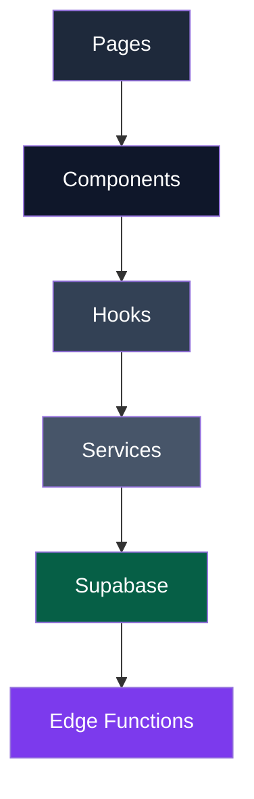
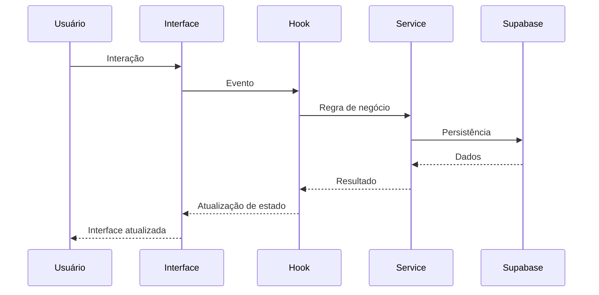
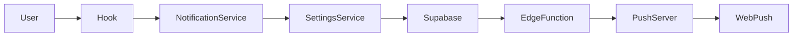
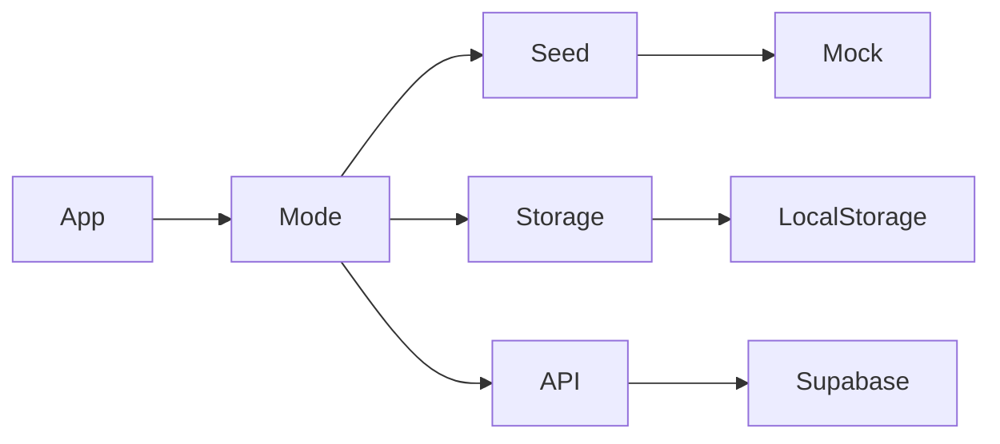

# 🌊 Fluidity


Aplicação web focada no **registro e acompanhamento do humor diário**, oferecendo uma experiência simples para monitoramento do bem-estar emocional através de check-ins, histórico, lembretes inteligentes e recursos voltados à saúde emocional.

---

# 📖 Visão Geral

O **Fluidity** nasceu com o objetivo de incentivar o hábito do registro emocional diário, permitindo que o usuário acompanhe sua evolução ao longo do tempo e receba lembretes inteligentes para manter a consistência dos registros.

O projeto foi desenvolvido seguindo princípios modernos de arquitetura de software, priorizando:

- Clean Code
- Baixo acoplamento
- Separação de responsabilidades
- Componentização
- Escalabilidade
- Facilidade de manutenção

---

# ✨ Funcionalidades

## ✅ Implementadas

### 🔐 Autenticação

- Cadastro de usuários
- Login
- Logout
- Recuperação de senha
- Atualização de senha
- Contexto global de autenticação

---

### 😊 Registro de Humor

- Check-in diário
- Regra de um registro por dia
- Confirmação antes do envio
- Histórico completo
- Visualização dos registros

---

### 🧘 Exercícios

- Recomendações de práticas de bem-estar
- Exercícios rápidos
- Navegação integrada ao fluxo principal

---

### ⏰ Lembretes Inteligentes

- Central de lembretes
- Configuração de lembretes
- Gerenciamento de notificações
- Configuração de horários
- Controle de habilitação/desabilitação

---

### 🔔 Notificações Push

- Infraestrutura Web Push
- Service Worker
- Push Subscription
- Push Server dedicado
- Supabase Edge Functions
- Persistência das inscrições
- Gerenciamento de chaves VAPID

---

### 📱 Progressive Web App (PWA)

- Instalável
- Experiência semelhante a aplicativo
- Funcionamento offline parcial
- Service Worker
- Preparado para notificações Push

---

# 🏗 Arquitetura

O projeto segue uma arquitetura em camadas buscando reduzir o acoplamento entre interface, regras de negócio e infraestrutura.


```mermaid
flowchart TD

Page["Pages"]
Component["Components"]
Hook["Hooks"]
Service["Services"]
Supabase["Supabase"]
Edge["Edge Functions"]

Page --> Component
Component --> Hook
Hook --> Service
Service --> Supabase
Supabase --> Edge

style Page fill:#1e293b,color:#fff
style Component fill:#0f172a,color:#fff
style Hook fill:#334155,color:#fff
style Service fill:#475569,color:#fff
style Supabase fill:#065f46,color:#fff
style Edge fill:#7c3aed,color:#fff
```

---

# 🔄 Fluxo de Dados


```mermaid
sequenceDiagram

participant U as Usuário
participant UI as Interface
participant H as Hook
participant S as Service
participant DB as Supabase

U->>UI: Interação
UI->>H: Evento
H->>S: Regra de negócio
S->>DB: Persistência

DB-->>S: Dados
S-->>H: Resultado
H-->>UI: Atualização de estado
UI-->>U: Interface atualizada
```

---

# 🔔 Fluxo das Notificações


```mermaid
flowchart LR

User --> Hook
Hook --> NotificationService
NotificationService --> SettingsService
SettingsService --> Supabase

Supabase --> EdgeFunction
EdgeFunction --> PushServer
PushServer --> WebPush
```

---

# 📁 Organização do Projeto

```text
src
├── components
├── config
├── hooks
├── lib
├── mocks
├── pages
├── services
├── types
├── utils

supabase
└── functions
    └── send-push

push-server
├── src
├── dist
└── package.json

docs
└── infra
```

| Diretório | Responsabilidade |
|------------|------------------|
| components | Componentes reutilizáveis |
| pages | Páginas da aplicação |
| hooks | Estado e lógica da interface |
| services | Regras de negócio e integração |
| config | Configurações globais |
| lib | Utilitários compartilhados |
| mocks | Dados simulados |
| types | Tipagens |
| utils | Funções auxiliares |
| supabase/functions | Edge Functions |
| push-server | Servidor responsável pelo envio das notificações Push |
| docs/infra | Documentação da infraestrutura |

---

# ⚙️ Stack Tecnológica

| Camada | Tecnologia |
|---------|------------|
| Frontend | React 19 |
| Linguagem | TypeScript |
| Build | Vite |
| Estilização | TailwindCSS |
| Backend | Supabase |
| Banco | PostgreSQL |
| Autenticação | Supabase Auth |
| Push Server | Node.js + Express |
| Push | Web Push API |
| Edge Functions | Supabase Edge Functions |
| Hospedagem Frontend | Vercel |
| Hospedagem Push Server | Railway |
| PWA | Service Worker |
| Roteamento | React Router |

---

# 🔀 Estratégia de Dados

O projeto suporta múltiplos modos de execução.


```mermaid
flowchart LR

App --> Mode

Mode --> Seed
Mode --> Storage
Mode --> API

Seed --> Mock
Storage --> LocalStorage
API --> Supabase
```

| Modo | Finalidade |
|-------|------------|
| Seed | Dados fixos para desenvolvimento |
| Storage | Persistência local |
| API | Persistência real no Supabase |

---

# 🚀 Executando Localmente

Clone o repositório:

```bash
git clone https://github.com/Projeto-Fluidity/fluidity
```

Acesse o projeto:

```bash
cd fluidity
```

Instale as dependências:

```bash
npm install
```

Inicie o frontend:

```bash
npm run dev
```

Aplicação disponível em:

```
http://localhost:5173
```

Para testar notificações Push localmente, execute também o servidor dedicado:

```bash
cd push-server

npm install

npm run dev
```

---

# 🔐 Variáveis de Ambiente

Frontend:

```env
VITE_SUPABASE_URL=
VITE_SUPABASE_ANON_KEY=

VITE_DATA_MODE=api
VITE_FORCE_ERROR=false

VITE_PUSH_API_URL=https://fluidity-production.up.railway.app
```

Push Server:

```env
SUPABASE_URL=
SUPABASE_SERVICE_ROLE_KEY=

VAPID_PUBLIC_KEY=
VAPID_PRIVATE_KEY=

PORT=3000
```

---

# 🏗 Infraestrutura

A documentação da infraestrutura encontra-se em:

```text
docs/
└── infra/
    ├── DEPLOYMENT.md
    ├── RAILWAY.md
    ├── VERCEL.md
    └── ARCHITECTURE.md
```

Esses documentos descrevem:

- arquitetura da plataforma;
- estratégia de deploy;
- integração entre Vercel, Railway e Supabase;
- configuração do Push Server;
- fluxo de CI/CD;
- procedimentos de auditoria;
- boas práticas para manutenção da infraestrutura.

---

# 🧪 Qualidade

Durante o desenvolvimento são adotadas as seguintes práticas:

- Auditoria antes de qualquer implementação
- Desenvolvimento incremental
- Commits pequenos e objetivos
- Pull Requests focadas
- Clean Code
- SOLID
- Componentização
- Hooks especializados
- Services desacoplados
- Documentação contínua
- Revisão da arquitetura

Validações recomendadas antes de abrir uma Pull Request:

```bash
npm run lint
```

```bash
npm run build
```

---

# 🛣 Roadmap

## 🚧 Em andamento

- Evolução das notificações inteligentes
- Agendamento automático de lembretes
- Insights emocionais

## 🔮 Futuro

- Dashboard analítico
- Gamificação
- Compartilhamento de progresso
- Aplicativo mobile
- Inteligência Artificial para recomendações personalizadas

---

# 👥 Autores

### 👨‍💻 Jair Sousa
**Full Stack Developer**

- GitHub: https://github.com/jair-sousa
- LinkedIn: https://www.linkedin.com/in/jair-sousa-ads

---

### 💻 Carlos Eduardo
**Front-end Developer**

- GitHub: https://github.com/Carlosedukj
- LinkedIn: https://www.linkedin.com/in/carlosedusobrinho/

---

### 🎨 Luiz Felipe
**UX Designer**

---

### 🧪 João Felismino
**QA Engineer**

- LinkedIn: https://www.linkedin.com/in/joaofelismino/

---

### 📋 Thaise Caires
**Scrum Master**

- LinkedIn: https://www.linkedin.com/in/thaisecaires

---

### 📌 Agatha Soares
**Product Owner**

- LinkedIn: http://linkedin.com/in/agathasoaresrita

---

# 📄 Licença

Projeto desenvolvido inicialmente para fins acadêmicos, estruturado para evoluir continuamente como uma plataforma de acompanhamento do bem-estar emocional.
